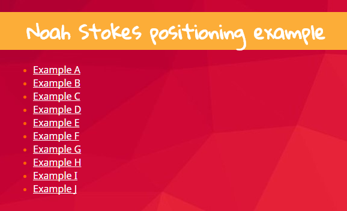
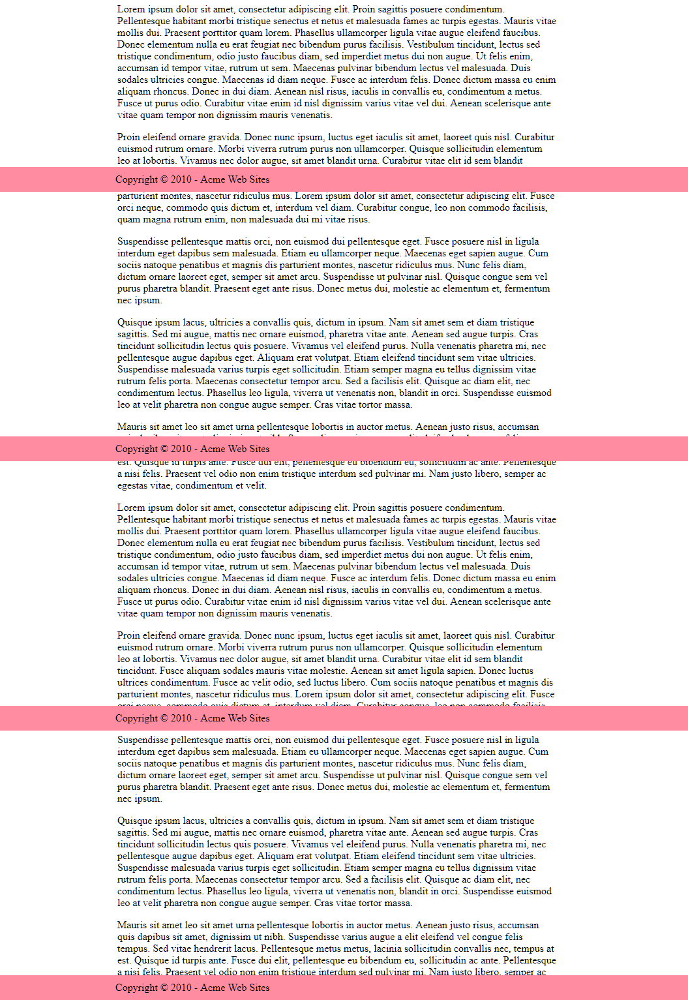

## **Positioning Noah Stokes**
### **¿Qué es?**
#### Es un programa el cual nos muestra una lista de enlaces los cuales nos redireccionan a una réplica de cada uno de los ejercios realizados por Noah Stokes en este [artículo](https://alistapart.com/article/css-positioning-101 "artículo") para poder explicar de una forma muy didáctica los distintos valores de *position* como *relative*, *static*, *fixed* y *absolute*; además de poder observar como alteran el flujo del programa cada uno de ellos.

### **Ejemplos de Noah Stoke**
#### Veamos algunos ejemplos que muestra nuestra página:
#### **Ejemplo A**

#### En el ejemplo A , puedes ver tres elementos apilados como una simple torre. Esto se logra con el valor *static* el cual es el valor por defecto de *position*.
     #caja_1 {
         position: static;
     }
#### **Ejemplo C**

#### En el ejemplo C , puedes observar que nuestros tres bloques están bien apilados, pero esta vez el bloque azul (#caja_2) se empuja 200 píxeles desde la izquierda. Esto se puede lograr modificando el valor de *position* a *relative* lo cual permite cambiar el valor de la propiedad left.
      #caja_2 {
          position: relative;
          left: 200px;
      }
#### **Ejemplo E**

#### En el ejemplo D , se observa cuatro recuadros, cada uno en una esquina de la ventana del navegador ya que al establer el *position-valor* de cada caja *absolute*, básicamente hemos creado un cuadro a cada esquina de nuestra ventana del navegador.Además un elemento absolutamente posicionado(*absolute*) se elimina del flujo normal. Esto significa que puede colocarlo en cualquier lugar, y no afectará ni se verá afectado por ningún otro elemento en el flujo.
      #caja_1 , #caja_2 , #caja_3 , #caja_4 {
          position: absolute;
      }
#### **Ejemplo I**

#### En el ejemplo I , muestra un pie de página con algún texto de copyright el cual mientras te desplazas por la página no se mueve. Esto se debe a que el valor de *position* de este elemento es *fixed*, el cual mantiene al elemento fijo en  la página.